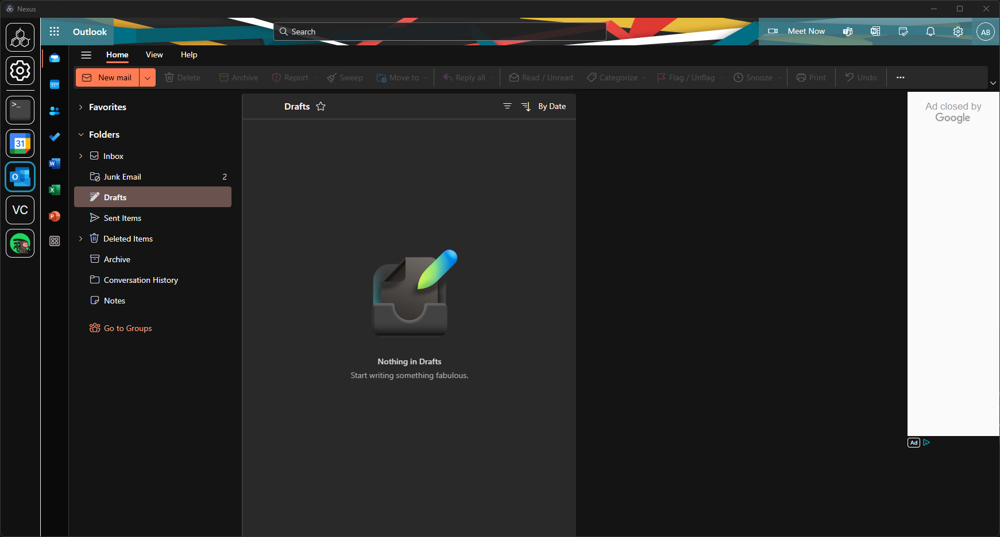

# Nexus: Microsoft Outlook

A Microsoft Outlook module for Nexus.

## Installation
1. Download the latest release `.zip`. 
2. In Nexus, navigate to **Settings** > **Import Module**
3. Select the downloaded `.zip` file to install.
